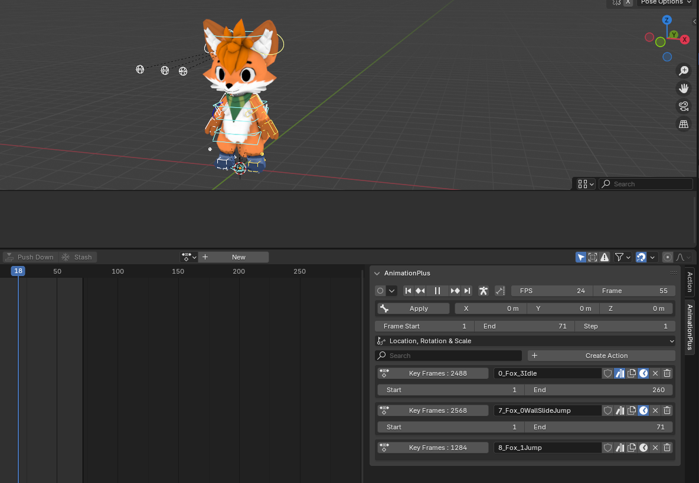

# Usage

The addon introduces various terms, which are explained here.

## Bake Sets

> **Bake Sets** are the most important part of the addon. These containers can be created/removed and they contain all the information that specify the what and how for **baking a single texture**. They can be individually baked for time save or you can bake all of them from the **Bake All Sets** Button

> You can have as many **Bake Sets** as you want.

> **Bake Sets are tied to a Scene**, so you can have multiple setups if you utilize multiple Scenes. **Great for reducing clutter**


* **Margin** - extra padding from the UV island borders, which prevent seams when dealing with LODs

* **XY** - The dimensions of the image that will be baked, can be toggled with the **Fixed Aspect Ratio** button to expose X and Y separately

* **Cage Extrusion** - How much to inflate the **Cage** object, useful for tweaking **High** to **Low** baking

* **Max Ray Distance** - How far can a ray be cast from a **High** object when projected to a **Low** object.

* **Bake Samples Per Pixel** - Controls how many passes each pixel in the baked texture will get during the baking. It's a good idea to **set this to a low value**, due to its **impact on bake time**

### Post-Process Effects

> These are applied after the bake. The effects stack and they are applied in top to bottom order.


### UDIMS

* **Add Udim Scale Rule Button** - Adds a resolution multiplier to any UV Islands that are in the corresponding UDIM tile

> **UDIMS are handeled automatically by Ultibake**, so you only have to ensure that the UV Islands are packed in the correct tiles. I highly recommend UVPackmaster3 for this.


### Bake Unit

>    With **Bake Units** we can define the **objects which are used for baking**. It also contains the target UVmap which is required for the bake. a **Bake Set** can contain any amount of **Bake Units**, which allows you to easily bake multiple objects to a single texture. 



* **Low** - the object/collection which will be baked
```Uses the UVmap selector shown in the image below```

* **High** - the object which will be projected to the surface of the **Low** object
```Commonly used for baking high detail meshes to low poly representations```

* **Cage** - the object which will define how the projection from **High** to **Low** baking will behave
```optional, rarely needed, but useful for complicated high to low bakes```

* **Decals** - the collection which will have its meshes projected to the **Low** object
```Similar to High to Low baking, but contains internal pre-processing to ensure better results```

> Any non-mesh based decal method like with the "Stamp It!" Addon does not require the decal collection, since its applied directly to the material.

* **Decals Only Toggle** - This will as it name implies, bake the **Decals** to the **Low** object, but not the underlying **Low** Object itself.
```Useful when your application requires you to apply decals on top of an existing texture```

* **Isolate** - a toggle which for the duration of the bake will hide all other objects, so that the **Low** object is not affected
```Useful for baking AO```

* **Collection Toggle** - a toggle which will convert the **Low** parameter to a collection instead
```This will prevent you from using High to Low baking or Decals, but its crucial for bakes that contain many objects```

* **Baking UV map** - Convenient selector for choosing what UVmap to use for the **Low** object or **Low** collection.
```With collections it will only show UVmaps that are shared with all the other objects in the low collection```


## Bake Types

> With **Bake Types** we can define what is baked from the materials that are applied to the objects in the **Bake Units**. The **Materials must utilize the Principled BSDF node** and any material which is not using this node will have to be manually converted to utilize it. **The Bake Types reflect the inputs of the Principled BSDF node** except for a few special types which are unique to the Addon.


> You can have **Multiple Bake Types** on a single **Bake Set**, allowing you to do channel packing. The image suffix is also generated from these


> Each **Bake Type** has a channel selector. Note that you can select multiple channels for a Bake Type with shift+left click

> To the right of the image name is a suffix```MRSAO``` , which is dynamically generated. The suffix can be disabled from the addon parameters by unticking **Auto Suffix** 


## Finalize

> **The last part in the pipeline** Once the bake is complete. With a single click you can create a copies of your **Bake Set** objects which now utilize only the baked textures. Great for ensuring consistency and also as a bonus makes your objects ready for exporting.


## Parameters

> There are various controls in the addon parameters, which need explaining.


* **Force Color Space** - a toggle which will give you an option to set the colorspace of a baked texture, manually setting this is rarely required since its automatically determined from the **Bake Types**. In certain situations you may need to control this explicitly


* **Toggle Console** - Whenever you bake something on Windows, a console will open up which has a visual progress bar and the option to cancel the bake with E+Ctrl```yes it's reversed(does not currently work on non-Windows machines)```

* **Open Target Folder** - Opens the bake folder upon completion

* **Auto Suffix** - Generates the suffix for the texturename from the baketypes


* **Ignore Shape Keys** - When baking objects which utilize shape keys, you might not want to bake the distorted mesh if it is affected by stuff like AO or Decals.


* **Global File Format** - Specify the texture format on a **Bake Set** basis or you can use the same file format for all **Bake Sets**.


* **Decal Subdivision** - Decals are shrinkwraped around the **Low** object, this ensures that the shrinkwrapping works correctly. Some meshes require more subdiv, which can be increased on the value to the right of this tickbox.

* **Use Global Decal Margin** - Just like with the margin for baking, you can specify how much margin the **Decals** have when they are baked to the UV islands on the Low object.

* **Decal Stack Height** - This is the height at which the **Decals** are shrinkwrapped to the surface of the low object, depending on the mesh resolution of the decal, this should.

* **Alpha Sensitivity** - Multiply all alpha channels by this value. Ideal for 
crisper edges when using decals. You can also manually do it in the material, but this is more convenient.


