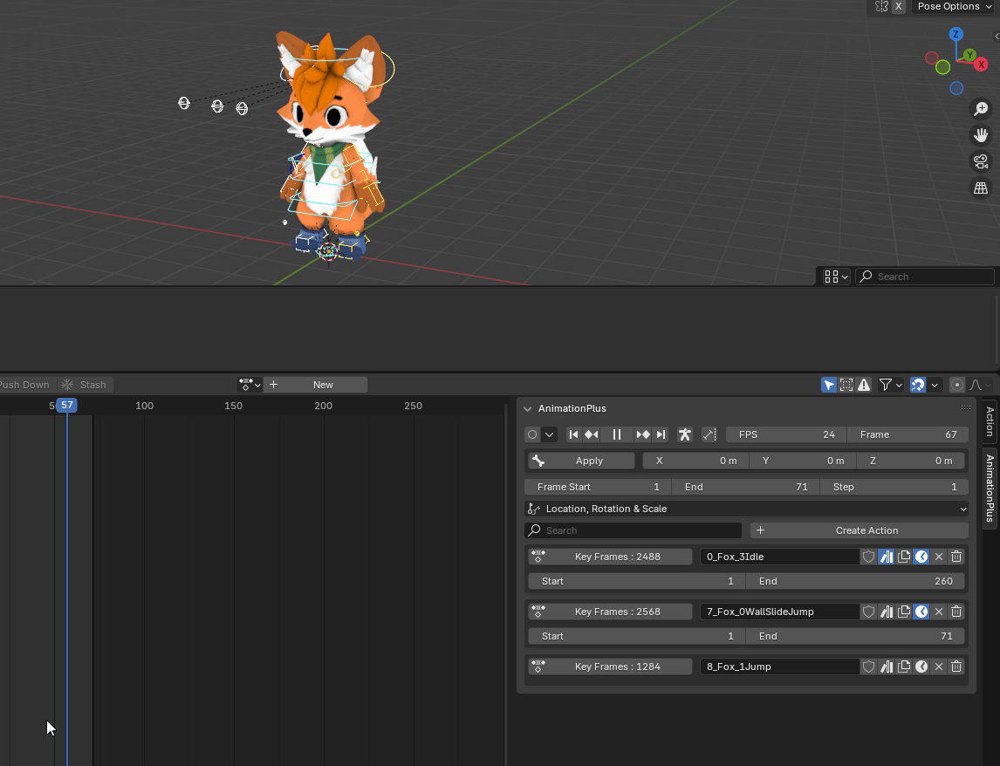
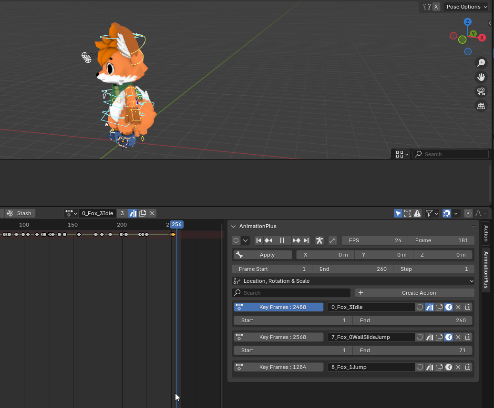
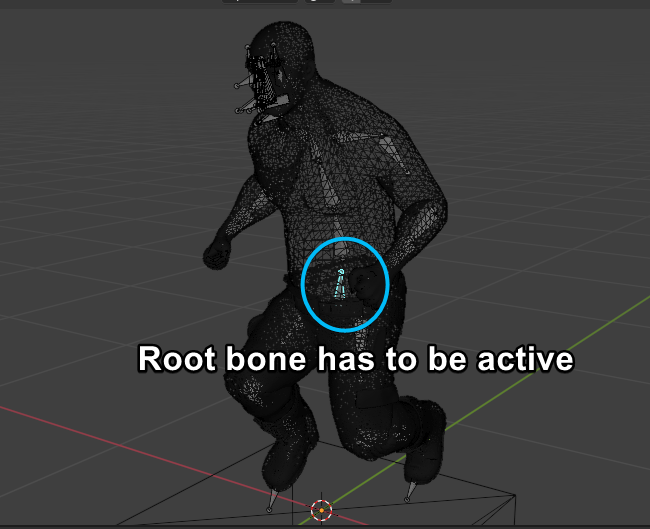
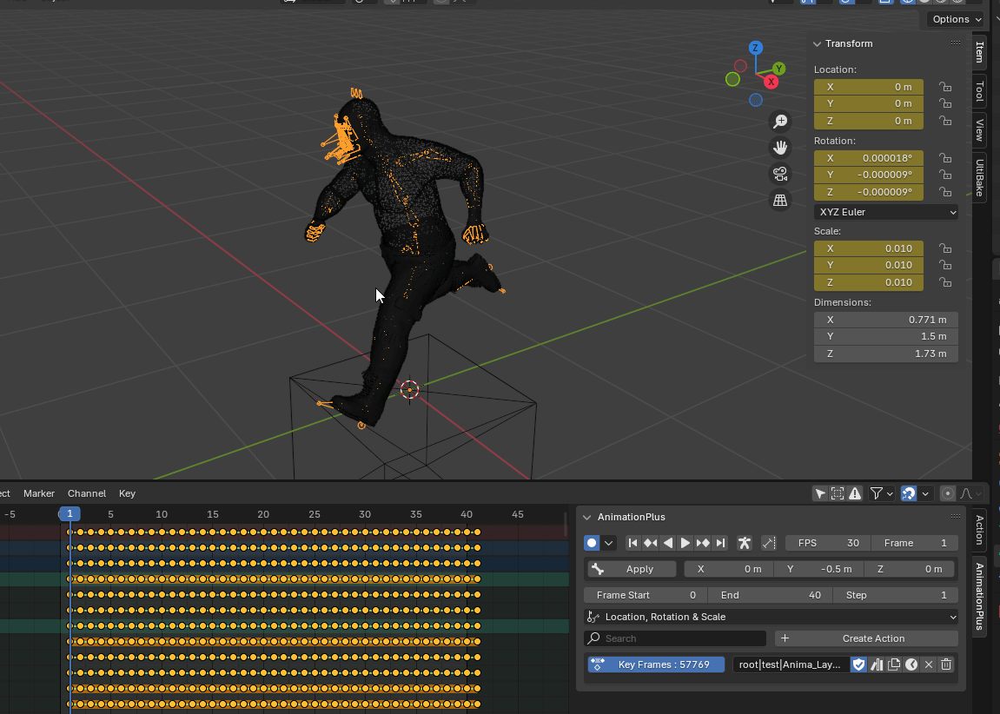
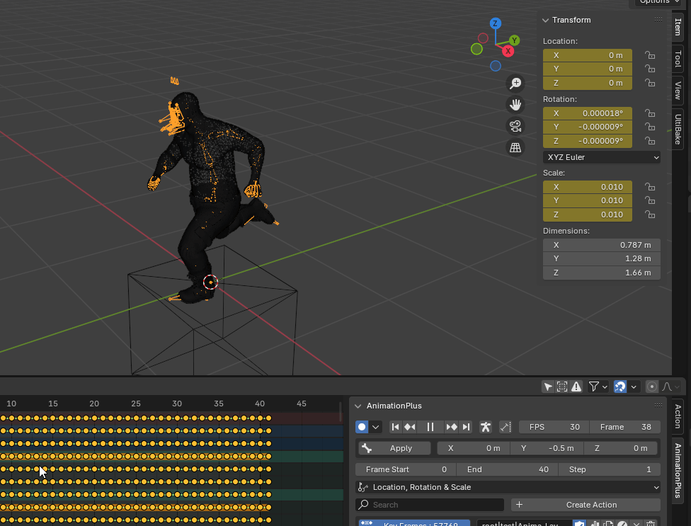
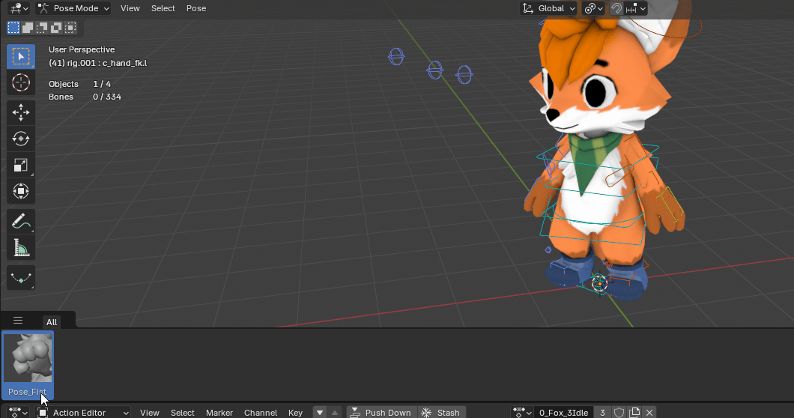

# 

## Quick Start

>The main UI of Animation+ is a combination of the **timeline** and **action editor** with some **Quality-Of-Life** improvements.

> You can easily select and even deselect an action, which normally isn't possible in Blender.

> Easily create actions. Also a clear indication if an action will be deleted automatically(orphaned)

> Ability to remove or clear actions. Normally you could only clear actions in the action editor

### Global action offset

> When importing animations, we might end up with an **unwanted offset** on the animation. We can remove this by **selecting the root bone** for the animation and applying an offset to it. This gets applied to all the keyframes on the active action.

### Action Scale

> When importing an animation, it's possible that it may have an unwanted scale. To solve this we simply click the **Smart Apply Scale** button and this will fix the scale for the armature and the active action.

> This is what normally happens when you try to apply scaling on an armature.

> Here is the desired result with **Smart Apply Scale**

### Automatic Timeline Range

> By toggling the clock button on the actions. You can define the start and end range for an action.

### Instant Poses

> Since poses are defined as actions that are marked as "assets" we can create them easily by just clicking the **book** button. The addon also ensures that it creates an icon from the current view.

### Support

> If you find yourself stuck or if something isn't working as you intended, ask about it in the [discord channel](https://discord.gg/RvT8jKRevG)